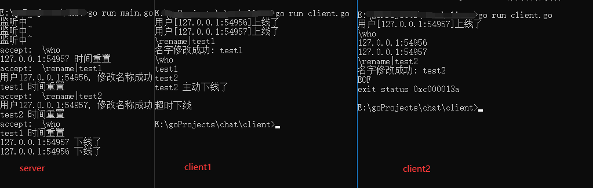

golang基于tcp实现简单的聊天功能

功能实现:
1. 客户端查询在线人数  \who
2. 客户端修改自己名称  \rename|name
3. 客户端指定聊天对象  \sendTo:name|massage
4. 客户端主动Ctrl+C退出
5. 客户端超过一定时间没有操作,服务端强制下线
6. 客户端上线下线向所有在线用户发送广播

基础知识:
1. channel go程之间通信
2. goroutine 多go程
3. select 监听管道
4. RWMutex map读写锁
5. tcp连接
6. 匿名函数
7. 指针变量

标准库:
1. fmt
2. net
3. strings
4. sync
5. time
6. bufio
7. os

效果展示:

